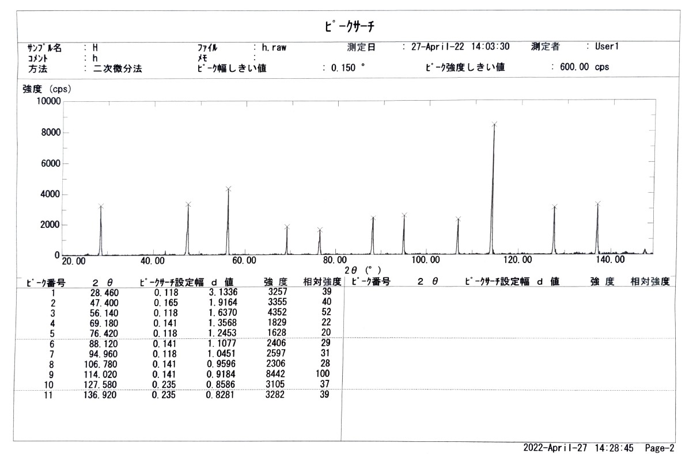

# XRD_analysis

### はじめに

### 概要
* 推しポイント1 : 格子の種類を判別できる.
* 推しポイント2 : 格子定数を誤差付きで求められる.
* 推しポイント3 : X 線の波長を変更できる.
* 激弱ポイント1 : 解析できるのは立方晶系のみ.
* 激弱ポイント2 : そりゃ, 上手くいかないときもある.

### 今後の予定
* README を追記する.
* ライセンスを決める.

### 免責事項

### ライセンス
